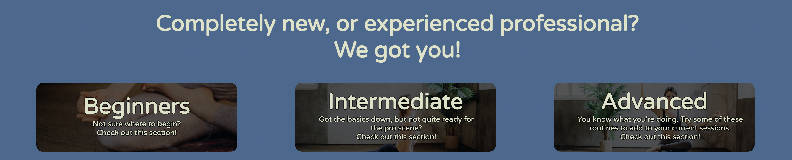
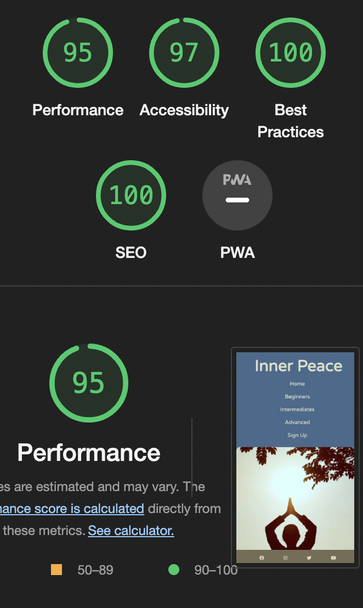

# Inner Peace

##### Link to deployed page - https://kuurosu.github.io/inner_peace/

### Description

This website is aimed at users that want to view meditation techniques and yoga positions that would be relevant to their skill level. There is a page for beginners, intermediates and advanced experience, as well as a sign up page for a newsletter.

### Features


- The inital mockup was to have a large image with a small motto to really introduce what the website was going to be all about. I did want a more fluid layout with the pictures and decription boxes next to them with a slight overlap, but during testing that proved to be an issue when styling the different window sizes. So I went with a stacked and side by side view.


- I went with a simple nav bar that had each page available from the start so you can get straight to where you want to go. This bar is available on every page in the same order to allow ease of access to where you need to be. When switchin to a tablet or mobile view the bar becomes stacked to still allow users to navigate to where they'd like to go. I also added resizing so when it's on mobile/tablet size the menu stacks and is in the middle of the screen.   


- I wanted the main picture to have the image of a silhouette of a person and kept her in the middle of the screen during the responsive tests and have the motto in the middle of them. 
- The image and descriptions below give an idea of why and how you can be performing yoga and meditation to really emphasize to the user why they would want to come to this site for assistance no matter the experience level. I have added padding to make it easier to read and see.



- Here I have presented an easy way for users progressing through the website to go straight to their level without having to go back to the top of the page. I also gave the font a black outline and used the brightness filter to darken the background to make it easier to read.


- I used a simple design for the footer where the images of the social medias could be easily seen and clicked on. They will link the user to the appropriate website and in a new tab. That way they don't lose where they were on the website if they wanted to come back.


- On each of the experience pages I wrote a simple title to introduce the user to the page that they are on and made it appropriate to their skill level. Then used a description box on the left with an example image on the right so they user has an idea in their mind of how to do it. The description includes how to do it with how many repetitions they may want to do as an example.


- The Sign-Up page is used for the user to stay engaged with updates on the page which would include new exercises and additions they may want to see in the future. The sign-up form includes their name and email address which are all required. There is also a checkbox to agree to receiving emails from the website which is also a required box. 

## Deployment

This website was developed using [VS Studio Code](https://code.visualstudio.com). It was added, committed and pushed using git to a GitHub repository.

To deploy the project to GitHub Pages from [the repository](https://github.com/Kuurosu/inner_peace) you can do the following:

1. Log into [GitHub](https://github.com).
2. Select the repository that you would like to deploy.
3. Click the Settings tab.
4. Find Pages in the left tab.
5. Make sure it's selected on "Deploy from branch".
6. Under Branch, Change "None" to main and Save.
7. It may take a few minutes for GitHub to deploy the page. Once completed there will be a link to the top that will bring you to your deployed page. 

### How to run the project locally

If you would like to clone this repository you will need the following: 

1. A [Github Account](https://github.com/).
2. Either [Chrome](https://www.google.com/chrome/) or [Firefox](https://www.mozilla.org/en-GB/firefox/new/?redirect_source=firefox-com) as your browser.
3. Install the Gitpod extension for your preferred browser: [Chrome](https://chrome.google.com/webstore/detail/gitpod-always-ready-to-co/dodmmooeoklaejobgleioelladacbeki) or [Firefox](https://addons.mozilla.org/en-GB/firefox/addon/gitpod/).
4. Restart your browser.
5. Log into [Gitpod](https://gitpod.io/login/).
6. Open the [repository](https://github.com/Kuurosu/inner_peace).
7. There will now be a Gitpod button at the top of the repository. 
8. Click it and it will open a new tab using Gitpod and create a workstation cloned from the original repository where you can edit it locally.

If you choose to use a local IDE such as VS Code etc. you can follow the steps below:

1. Navigate to [GitHub CLI](https://cli.github.com).
2. On Mac, copy ```brew install gh``` On Windows, copy ```winget install --id GitHub.cli``` (You will need [HomeBrew](https://brew.sh) previously installed for Mac, or [WinGet](https://github.com/microsoft/winget-cli) previously installed for Windows.)
3. Paste the OS appropriate code into Terminal (Mac) or CMD prompt (Windows).
4. This will take a few minutes to install the appropriate GitHub CLI onto your PC.
5. Once completed, open the [repository](https://github.com/Kuurosu/inner_peace).
6. Click the green "Code" icon.
7. Click GitHub CLI tab.
8. Copy the link.
9. In your preferred IDE, create or navigate to a directory you would like to clone the repository to.
11. Open the Terminal and paste the link from step 8. 
```
gh repo clone Kuurosu/inner_peace
```
12. Press enter and it should clone the repository for you to work with locally. 

Any issues or troubleshooting with GitHub CLI can be found [here](https://cli.github.com/manual/).

## Testing

- Nav bar links take you to the expected page. Working as intended.

- Skill boxes on homepage take you to the relevant skill level page. Working as intended.

- Social media links in footer expected to take you to the relevant social media page in a new browser tab. Working as intended.

- Newsletter sign up requires a name, surname, email address and tick box to be all filled and ticked to allow submission. Working as intended.

- I have tested the website on Chrome, Firefox and Safari and it loads and layout looks the same on all.

- Content is centered on all screen sizes from iPhone SE/5 up to an iMac 5k.

### User Stories

- A beginner user wanting to find an introduction to yoga and meditation. They can find information and a beginner program. 

- An experienced user that needs an idea for more exercises to add to their routine. They can find the intermediate or advanced page for them.

- A user who might know what they're doing and would just like to keep up with updates can use the sign up for the newsletter.

### Validator Testing

- I've used Nu HTML checker and have no errors after testing. Just one warning which was to consider using a header in my about section. But as it didn't require one I have chosen to omit that. - https://validator.w3.org/nu/?doc=https%3A%2F%2Fkuurosu.github.io%2Finner_peace%2F

- I've used W3C CSS Validation Service to confirm no errors after multiple testing and finding bugs - https://jigsaw.w3.org/css-validator/validator?uri=https%3A%2F%2Fkuurosu.github.io%2Finner_peace%2F&profile=css3svg&usermedium=all&warning=1&vextwarning=&lang=en

### Accessibility



- After using Lighthouse I can confirm that the accessbility for users are good.

### Unfixed Bugs

- I can't get the footer to stretch across the entire page unless it is fixed. Ideally I'd like to come back and fix the issue which I suspect is because of the layout I have done with the rest of index.html. 

## Credits

### Acknowledgements

- I'd like to thank my mentor Brian Macharia who assisted me with code reviews and giving ideas on more appropriate layouts. 

### Content

- The routine and description content of the page was written by me using pre-existing knowledge.

- I used form layout from the Love-Awesome project.

- The icons and script found in the footer bar were taken from https://fontawesome.com/

- I used a text shadow technique from a stackoverflow page found here https://stackoverflow.com/questions/2570972/css-font-border

### Media

- The media used was taken from https://www.pexels.com/. I found images that suited my needs and wrote a simple routine to go along with them. 

- The colour scheme used was from a website https://coolors.co/ to generate a similar and complimenting colour scheme.
